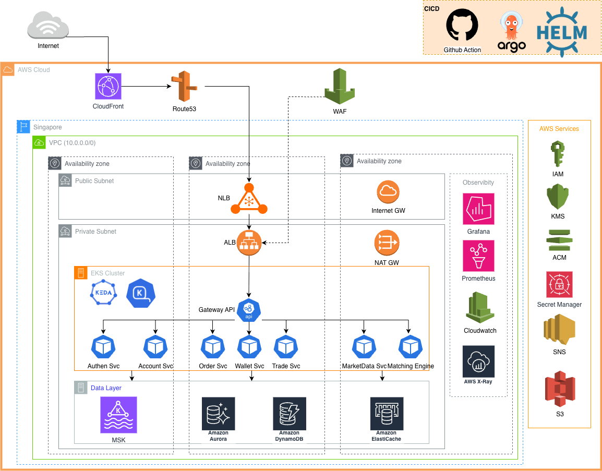

# Problem 2 – Highly Available Trading System Architecture

---

## Architecture Diagram




## 1. Scope & Feature Selection

Rather than covering every Binance feature, this design focuses on six pillars that drive the hardest infrastructure problems:

| Feature | Why it is hard |
|---|---|
| **User Auth & Accounts** | Stateless JWT at scale, MFA, session revocation |
| **Order Management** | High-write throughput, idempotency, strict ordering |
| **Order Matching Engine** | Microsecond-sensitive, single-threaded, must not lose state |
| **Real-time Market Data** | Millions of concurrent WebSocket subscribers, fan-out at scale |
| **Wallet & Balance Ledger** | ACID correctness, double-entry bookkeeping, audit trail |
| **Notifications** | Event-driven delivery across email, SMS, and push at high volume |

---

## 2. Architecture Components

### Edge & Traffic Layer
**CloudFront → Route 53 → NLB (public) → ALB (internal) → EKS**

| Service | Role | Why | Alternatives |
|---|---|---|---|
| **CloudFront** | CDN for static assets and cacheable API responses; Shield Advanced for volumetric DDoS; **no WAF** (cost saving — WAF sits solely on ALB) | Shield Advanced absorbs L3/L4 floods before they reach the region; CDN offloads the majority of read traffic | Cloudflare (CDN + WAF + DDoS in one, but exits AWS ecosystem) |
| **Route 53** | DNS with latency-based routing and health-check failover to secondary region | Native AWS health check integration; automatic DNS failover in < 60s | Cloudflare DNS |
| **NLB** (internet-facing, L4) | Public entry point with static Elastic IPs; Security Group restricts inbound to CloudFront IP prefix list; routes FIX protocol (TCP port 4197) directly to FIX Gateway | Static IPs are required by institutional/HFT clients for their own firewall allowlisting; L4 handles FIX which cannot go through ALB | AWS Global Accelerator |
| **ALB** (internal, L7) | Placed in private subnets with no public IP; sole AWS WAF layer; TLS termination via ACM; OIDC → Cognito for JWT validation; managed by AWS Load Balancer Controller via Kubernetes Gateway API CRDs; **Proxy Protocol v2** enabled so WAF sees real client IPs, not NLB's private IP | Internal scheme means the ALB is unreachable from the internet even with a misconfigured NLB SG; WAF + OIDC at ALB level means auth and filtering happen before requests reach any pod | Envoy Gateway (more features, requires Envoy expertise) |

### Kubernetes Gateway API (AWS Load Balancer Controller)

The ALB is configured via the [Kubernetes Gateway API](https://kubernetes.io/docs/concepts/services-networking/gateway/) — a vendor-neutral specification using `GatewayClass`, `Gateway`, and `HTTPRoute` CRDs. AWS LBC is the implementation: it provisions and manages the ALB directly from these CRDs with no extra in-cluster proxy pod.

**Why Gateway API over plain Ingress:** role-based ownership (infra team owns `Gateway`, app teams own `HTTPRoute`), native traffic weighting for canary deploys, and portability — switching to Envoy Gateway later only requires changing `gatewayClassName`.

**Rate limiting:** WAF rate-based rules per IP, per URI, and per `X-Api-Key` header.

### Application Services (EKS — 3 AZs)

EKS is chosen over ECS/Lambda because trading workloads have tight latency budgets (Lambda cold starts are unacceptable on the order path), and Kubernetes provides fine-grained pod affinity, HPA, and KEDA for event-driven autoscaling on MSK consumer lag.

| Service | Responsibility |
|---|---|
| **Auth Service** | Issues short-lived JWT access tokens and rotating refresh tokens; enforces TOTP/WebAuthn MFA |
| **Account Service** | User profiles, KYC state machine |
| **Order Service** | Validates orders, writes idempotent records to DynamoDB, publishes to the `orders` Kafka topic |
| **Wallet Service** | Balance reads; withdrawal requests with dual-approval; DynamoDB conditional writes for atomic deductions |
| **Trade Service** | Consumes `fills` topic; records executed trades in Aurora; triggers balance updates |
| **Market Data Service** | Consumes `fills` and `candles` topics; maintains in-process order book snapshot; pushes diffs to Redis Pub/Sub for WebSocket fan-out |
| **Notification Service** | Consumes `fills`, `orders`, `balances`, and `alerts` Kafka topics; routes events to Amazon SNS for fan-out to SES (email), Pinpoint (SMS), and mobile push (APNs/FCM) |

### Messaging — Amazon MSK (Kafka)

Kafka is the **single source of truth for all state transitions**. Every order, fill, balance change, and notification event is an immutable record on a Kafka topic, giving full replay capability, backpressure isolation between services, and a built-in audit trail.

Topics are keyed by `symbol` or `user_id` so all events for a given symbol land on the same partition — the Matching Engine always reads a single partition with strict ordering and no coordination.

MSK Tiered Storage is enabled from launch: segments older than 24 hours move to S3 automatically, keeping broker storage lean.

**Alternatives considered:** SQS/SNS — no replay and no cross-consumer ordering; EventBridge — too high latency for market data paths.

### Data Stores

| Store | Spec | Why | Alternatives |
|---|---|---|---|
| **Aurora PostgreSQL (Multi-AZ)** | Multi-AZ cluster; Global Database cross-region; RDS Proxy for connection pooling | Global Database replication < 1s lag; RDS Proxy multiplexes thousands of pod connections — prevents exhaustion at scale | Cloud Spanner (globally distributed ACID, but costly); RDS PostgreSQL (less automation) |
| **DynamoDB (Global Tables)** | Single-digit ms reads; on-demand or provisioned capacity; Global Tables active-active; conditional writes for optimistic locking | Global Tables multi-region with zero ops | MongoDB Atlas (flexible schema, higher ops burden); Cassandra (no conditional writes for balance safety) |
| **ElastiCache Redis (Cluster Mode)** | Cluster mode; 2 replicas per shard; Multi-AZ auto-failover | pub/sub channels fan out market data diffs to WebSocket pods across shards | Valkey (open-source Redis fork, same API, lower licensing risk); KeyDB (multi-threaded, higher single-node throughput) |
| **S3 + Glacier** | unlimited storage; lifecycle to Glacier Instant Retrieval after 90 days| Cold storage for audit logs and Matching Engine WAL archives| GCS / Azure Blob (viable multi-cloud, adds complexity in a single-AWS setup) |

### Security

| Control | Implementation |
|---|---|
| **Network isolation** | ALB and NLB in public subnets; all databases, MSK, and Matching Engine in private subnets with no inbound internet route |
| **Secrets management** | AWS Secrets Manager with automatic rotation; no secrets in env vars or container images |
| **Encryption at rest** | AWS KMS CMKs for Aurora, DynamoDB, MSK, and S3 |
| **Zero-trust IAM** | Each EKS pod has its own IAM role (IRSA) with least-privilege policies |

### Observability

| Signal | Stack |
|---|---|
| Metrics | Prometheus → Grafana; CloudWatch Container Insights for EKS node metrics |
| Logs | Fluent Bit DaemonSet → CloudWatch Logs + S3 |
| Tracing | OpenTelemetry SDK → AWS X-Ray (distributed trace per order lifecycle) |
| Alerting | Grafana → PagerDuty on-call rotation |
| Key SLOs | Order submission p99 < 50ms · WS delivery p99 < 100ms · Matching Engine uptime > 99.99% |

### Scalability

**Aurora:** Read/write split via RDS Proxy (writes to writer, reads to reader endpoint). Aurora Auto Scaling adds read replicas at 70% CPU. At 100× traffic, trade history reads migrate to Redshift Serverless; Aurora remains OLTP-only.

**Redis:** Cluster mode with 3 shards × 2 replicas across 3 AZs. ElastiCache Auto Scaling adjusts shard count at 65% CPU. At 1000× subscribers, replace Redis pub/sub fan-out with a dedicated MSK topic per symbol consumed directly by WebSocket pods.

**MSK:** Partition count is the primary lever — topics keyed by `symbol` allow consumer parallelism to scale with partition count. MSK rolling broker upgrades are zero-downtime. At 100× volume, enable tiered storage and increase partition counts; at 1000×, migrate to MSK Serverless.

### CI/CD

```
GitHub Actions → Build & push Docker image to ECR
→ Update Helm values in Git → ArgoCD detects drift
→ Rolling update to EKS → Smoke test job
→ Canary 5% → Auto-promote after 30 min if error rate < 0.1%
```

---

## 3. High Availability & Disaster Recovery

### Multi-AZ (Primary Region — Singapore `ap-southeast-1`)

| Component | HA Mechanism |
|---|---|
| EKS nodes | `topologySpreadConstraints` — at least 1 pod per AZ |
| ALB | AWS-managed; spans all AZs automatically |
| Aurora PostgreSQL | Multi-AZ synchronous standby; automatic failover < 30s |
| MSK | 3 brokers, one per AZ; `min.insync.replicas=2` |
| ElastiCache Redis | Cluster mode: 3 shards × 2 replicas, one replica per AZ |
| DynamoDB | Fully managed; Global Tables replicate to secondary region |
| Matching Engine | Active/Standby across 2 AZs; leader election via DynamoDB |

### (Optional) Multi-Region DR (Secondary — Tokyo `ap-northeast-1`)

**DR Tier: Warm Standby** (~35% of primary cost). Tokyo runs all components at minimum capacity, scaling to full on failover. Tokyo is chosen for independent submarine cable routes, separate regulatory jurisdiction, and mature AWS financial-services infrastructure.

| Component | DR Strategy | RPO | RTO |
|---|---|---|---|
| Aurora PostgreSQL | Global Database — dedicated replication link, < 1s lag; single API call to promote | < 1s | < 2 min |
| DynamoDB | Global Tables — active-active; conditional writes prevent conflicts | < 1s | 0 (already active) |
| MSK Kafka | MirrorMaker 2 continuously mirrors all topics; offset translation preserved for consumer resume | < 5s | < 1 min |
| EKS services | Cluster kept at minimum nodes, Deployments at 0 replicas; ArgoCD scales up on `DR_ACTIVE=true` Git flag; Karpenter provisions nodes in ~60s as pods become `Pending` | N/A (stateless) | < 2 min |
| Matching Engine | Standby EC2 in Tokyo consumes replicated topic to keep order book warm; leader election on failover | 0 (warm) | < 1 min |
| Redis | Not replicated — rebuilt from Aurora/MSK in < 30s (cache is ephemeral) | N/A | < 30s |
| S3 | Cross-Region Replication to Tokyo | < 15 min | 0 (already synced) |
| **Overall platform** | Route 53 health check → DNS failover → scale-up | **< 30s** | **< 5 min** |

**Failover:** Route 53 health check fails 3 × 10s → DNS TTL expires → clients resolve to Tokyo NLB → Aurora promoted → ArgoCD scales EKS → Matching Engine elected → trading resumes. Total: ~5 minutes.

**Failback is always manual** to prevent split-brain. Uses Route 53 weighted routing (10% → 100%) for gradual traffic shift back to Singapore.

---

## 4. Scaling Plan

### EKS Cluster Scaling

EKS scaling operates at two levels: **pod scaling** (HPA + KEDA) and **node scaling** (Karpenter).

#### Pod Scaling — HPA + KEDA

HPA and KEDA are used together, not as alternatives. HPA handles resource-based scaling; KEDA extends it with external event sources.

| Scaler | Trigger | Applied to |
|---|---|---|
| **HPA** | CPU utilisation > 70% | All services — baseline protection against CPU spikes |
| **HPA** | Memory utilisation > 80% | Market Data Service, WebSocket nodes — memory-bound fan-out workloads |
| **KEDA** | MSK consumer lag (`orders` topic) > 1,000 | Order Service — scales consumers when order queue backs up |
| **KEDA** | MSK consumer lag (`fills` topic) > 500 | Trade Service, Notification Service — keeps fill processing latency low |
| **KEDA** | Redis pub/sub queue depth | WebSocket nodes — scales out when market data fan-out falls behind |
| **KEDA** | ALB request count per target (via CloudWatch) | Auth Service — scales on actual inbound request rate, not just CPU |

**Why KEDA on top of HPA:** CPU and memory are lagging indicators — by the time CPU spikes, requests are already queuing. KEDA's MSK consumer lag metric is a leading indicator: it detects that the Order Service is falling behind *before* CPU saturates, giving the scaler time to add pods before users feel latency.

KEDA's `ScaledObject` wraps the existing HPA — both can coexist on the same Deployment. KEDA manages the HPA's `minReplicas`/`maxReplicas` dynamically based on the external metric.

#### Node Scaling — Karpenter

Karpenter replaces Cluster Autoscaler for node provisioning. Rather than scaling pre-defined node groups, Karpenter watches for `Pending` pods and provisions the right instance type for the workload in seconds — no node group configuration needed.

**Why Karpenter over Cluster Autoscaler:**
- Provisions nodes in **~60 seconds** vs ~3 minutes for Cluster Autoscaler (no need to wait for Auto Scaling Group warmup)
- Selects the **optimal instance type** automatically based on pod resource requests — avoids over-provisioning from fixed node group sizes
- Supports **consolidation**: continuously right-sizes the cluster by bin-packing pods onto fewer nodes and terminating underutilised ones, reducing cost during low-traffic periods
- Native **Spot instance fallback** — defines a priority list of instance families; automatically falls back to on-demand if Spot capacity is unavailable

---

### Data Store Scaling

**Aurora:** Read/write split via RDS Proxy; Aurora Auto Scaling adds read replicas at 70% CPU. At 100× traffic, trade history reads migrate to Redshift Serverless; Aurora remains OLTP-only.

**Redis:** Cluster mode with 3 shards × 2 replicas across 3 AZs. ElastiCache Auto Scaling adjusts shard count at 65% CPU. At 1000× subscribers, replace Redis pub/sub fan-out with a dedicated MSK topic per symbol consumed directly by WebSocket pods.

**MSK:** Partition count is the primary lever — topics keyed by `symbol` allow consumer parallelism to scale with partition count. MSK rolling broker upgrades are zero-downtime. At 100× volume, enable tiered storage and increase partition counts; at 1000×, migrate to MSK Serverless.

---

### Growth Triggers

| Growth stage | Actions |
|---|---|
| **10× users** | KEDA + HPA absorbs pod-level load automatically; Aurora read replica auto-scaling; CloudFront caches more public endpoints |
| **100× order volume** | Shard Matching Engine per trading pair group; migrate trade history reads to Redshift Serverless; Direct Connect for HFT co-location |
| **1000× (global)** | Active-active across 3 regions (Asia, Europe, Americas); DynamoDB Global Tables as coordination layer; MSK Serverless; dedicated market data multicast fabric |

**Cost levers:** Graviton3 (ARM) instances for EKS and Aurora replicas (~40% cheaper); Reserved Instances for baseline; Spot for batch/analytics; MSK Tiered Storage; S3 Intelligent-Tiering for audit logs.

---
